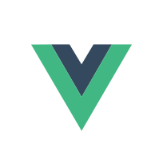
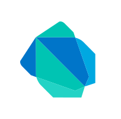
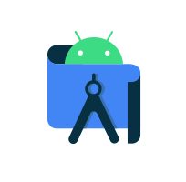

# Hi👋 I'm Robaeit Hossan Rihan
### MERN STACK developers.

 

  
  
  
  

 

### Love to code

  
  
  <!--  -->
  
  
  
  <!--  -->
  <!--  -->
  
  <!--  -->
  <!--  -->
  <!--  -->
  <!--  -->
  

### Favourite Tools

<!--  -->
<!--  -->

<!--  -->

###  Open Source Contribution Going:

<table>
<tbody>
<tr>
<td>

</td>

</tr>

### About
Robayet Hossan Rihan – A prominent figure in Bangladesh's programming community, renowned for expertise in web and mobile application development with over 3 years of hands-on experience. A true innovator, Robayet excels in research & development, teaching, and community leadership, making a lasting impact in the field and inspiring the next generation of developers.

<table>
<tbody>

<tr>
<td>

</td>

<td>

</td>
</tr>

</tbody>
</table>

